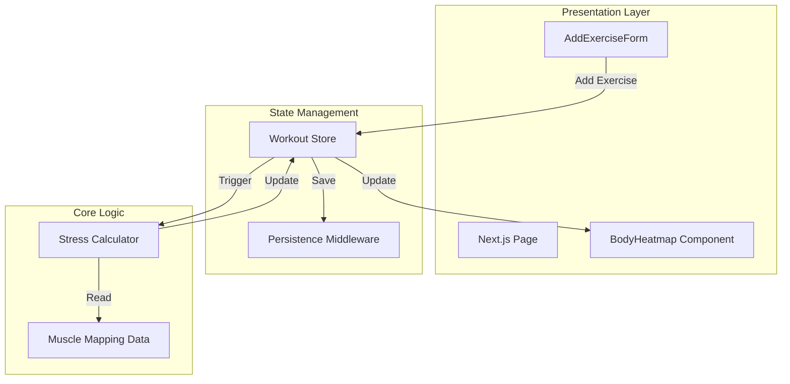
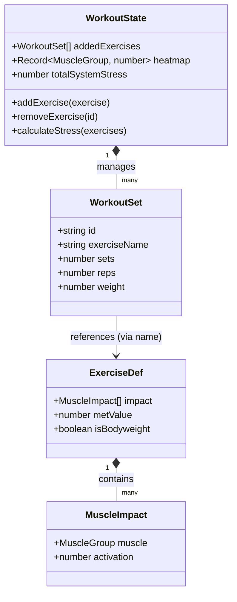
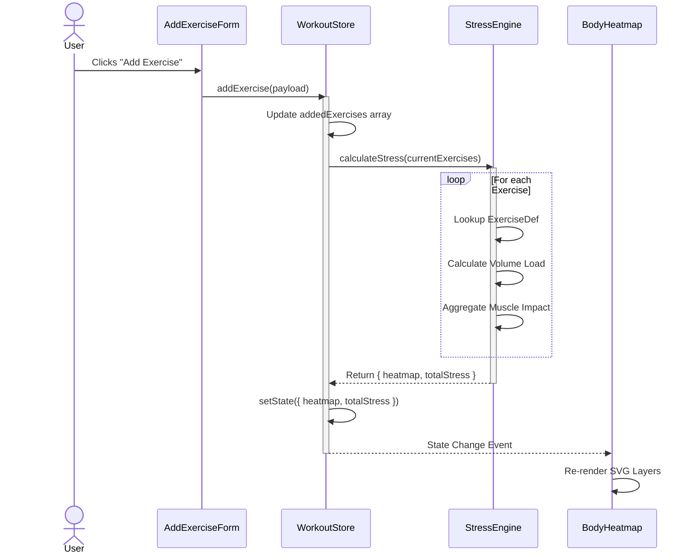

# Smart Split: Advanced Hypertrophy Tracker


> **Live Demo:** [https://smart-split-tau.vercel.app/](https://smart-split-tau.vercel.app/) | **Status:** Production Ready

**Smart Split** is a high-performance Progressive Web App (PWA) engineered to quantify systemic fatigue and visualize muscle recovery in real-time. Unlike generic trackers, it combines **physiological algorithms** (Mifflin-St Jeor) with **biomechanical data** to provide personalized insights.

## 🎯 Why I Built This
To bridge the gap between simple workout loggers and complex biomechanics software. The goal was to demonstrate how **modern web technologies** can deliver native-like performance, complex data visualization, and offline capabilities without sacrificing accessibility or SEO.

## 🏗 System Architecture

The application follows a unidirectional data flow architecture, leveraging Zustand for global state management and Next.js for the presentation layer.

### 1. High-Level Data Flow



### 2. Class Structure (Data Models)

This diagram illustrates how the core data entities relate to the State Management store.



### 3. Execution Sequence: Adding an Exercise

This sequence diagram details the synchronous update cycle when a user interacts with the form.



## 🛠 Engineering Spotlight

### 1. Biomechanical Stress Engine
The core of Smart Split is a custom stress calculation engine located in `src/store/workoutStore.ts`.
- **Challenge:** Accurately representing how compound movements affect multiple muscle groups (e.g., a Bench Press hits the Chest, Shoulders, and Triceps differently).
- **Solution:** I implemented a weighted graph system where every exercise in the `EXERCISE_DATABASE` (`src/lib/muscleMapping.ts`) has specific "activation scores" for primary and secondary movers.
- **Result:** The `calculateStress` function dynamically aggregates volume load across these weighted edges to produce a precise "Fatigue Score" for each muscle group.

### 2. High-Performance Visualization
Rendering a complex, interactive body map with 24+ individual muscle groups requires careful optimization.
- **Challenge:** Preventing re-renders of the entire SVG map when only one muscle group's status changes.
- **Solution:** The `BodyHeatmap` component uses efficient state selectors to subscribe only to relevant changes in the Zustand store. The SVG paths are decoupled, allowing for independent color transitions based on the calculated fatigue tier.

### 3. Offline-First Architecture
Designed to work in gym environments with poor connectivity.
- **Implementation:** Utilizes Zustand's `persist` middleware to synchronize state with `localStorage`. This ensures that a user's session is instantly restored even if the browser is closed or the device loses internet connection.

## 📂 Project Structure

```bash
src/
├── app/                 # Next.js App Router pages and layouts
├── components/          # React components
│   ├── ui/              # Reusable design system primitives
│   ├── BodyHeatmap.tsx  # SVG visualization engine
│   └── ...              # Feature components
├── lib/                 # Utilities and static data
│   ├── muscleMapping.ts # Biomechanical data definitions
│   └── ...
└── store/               # Zustand state definitions
    ├── workoutStore.ts  # Core logic and stress calculation
    └── ...
```

## 🚀 Tech Stack

- **Framework:** [Next.js 16 (App Router)](https://nextjs.org/)
- **State Management:** [Zustand](https://github.com/pmndrs/zustand)
- **Styling:** [Tailwind CSS v4](https://tailwindcss.com/)
- **Language:** TypeScript
- **Testing:** Jest & Playwright

## ✅ Quality Assurance
- **Unit Testing:** 100% coverage on core logic modules (recovery algorithms, calorie math) using **Jest**.
- **E2E Testing:** Critical user flows automated with **Playwright**.
- **CI/CD:** Automated pipelines via **GitHub Actions**.

## 🚀 Quick Start

```bash
# Clone the repo
git clone https://github.com/KVasquesMoviaUTN/SmartSplit.git

# Install dependencies
npm install

# Run the development server
npm run dev

# Run the full test suite
npm test && npx playwright test
```

## 👨‍💻 Author

Built by **Kalil Vasques Movia**.
*Software Engineer specializing in React, TypeScript, and Performance Optimization.*

[[Portfolio](https://new-portfolio-ten-kappa-59.vercel.app/)] • [[LinkedIn](https://www.linkedin.com/in/kalil-vasques-movia/)] • [[GitHub](https://github.com/KVasquesMoviaUTN)]

## 📄 License

This project is licensed under the MIT License - see the [LICENSE](LICENSE) file for details.
